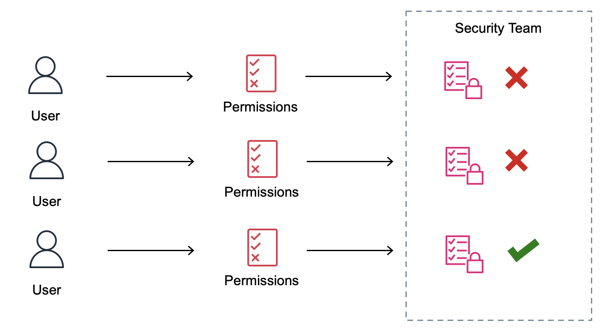
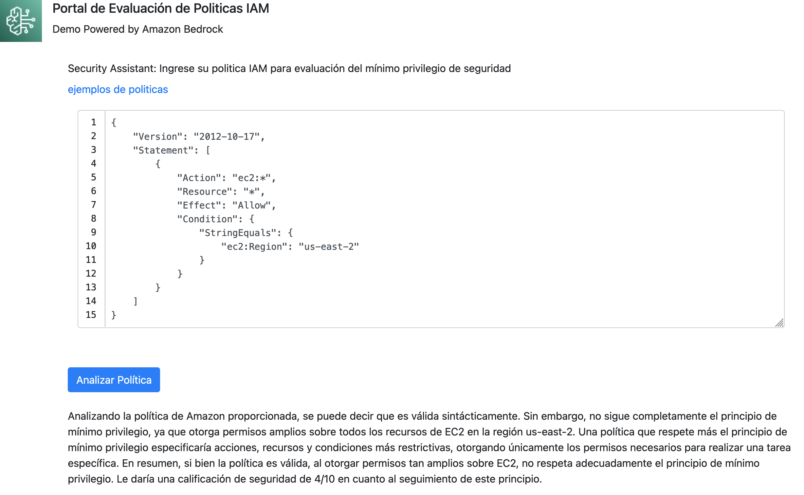
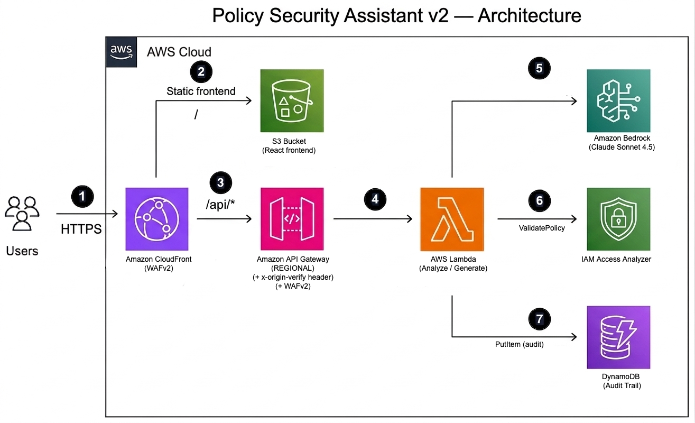
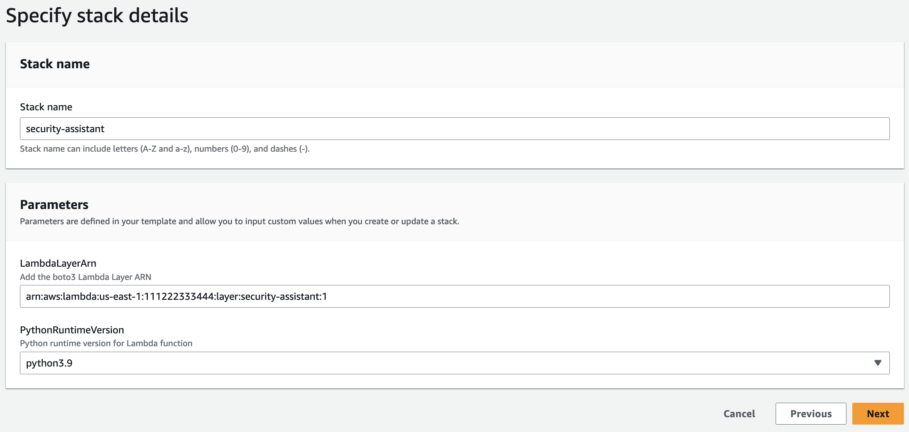
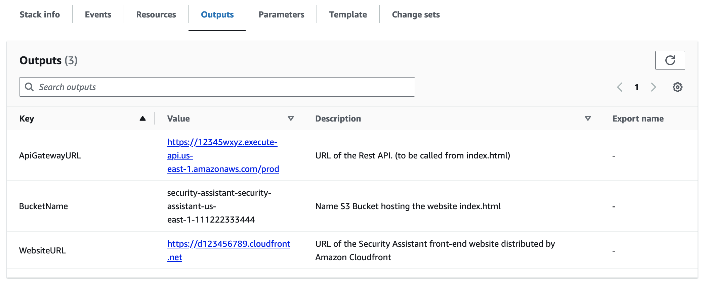

# Cómo construir un asistente de seguridad con IA Generativa usando Amazon Bedrock y AWS

[Read in English](./README.md)

[Amazon Bedrock](https://aws.amazon.com/bedrock/) es un servicio totalmente gestionado que ofrece una selección de modelos fundacionales (FM) de alto rendimiento de las principales empresas de IA, como AI21 Labs, Anthropic, Cohere, Meta, Stability AI y Amazon, a través de una sola API, junto con un amplio conjunto de capacidades que necesita para crear aplicaciones de IA generativas, lo que simplifica el desarrollo y, al mismo tiempo, mantiene la privacidad y la seguridad. Utilizando Amazon Bedrock, es posible construir un portal de autoservicio web que permita validar si una política de [AWS Identity and Access Management (IAM)](https://aws.amazon.com/iam/) cumple con el principio de mínimo privilegio, este enfoque busca agilizar el proceso de aprobación de permisos dentro de una organización sin comprometer la seguridad.

Las organizaciones se encuentran en constante evolución desarrollando nuevos proyectos y aplicaciones, parte esencial para el funcionamiento de estas aplicaciones es que cuenten con permisos y accesos para realizar distintas acciones en servicios y recursos de AWS, estas acciones se especifican a través de [políticas IAM](https://docs.aws.amazon.com/IAM/latest/UserGuide/access_policies.html), las cuales se expresan en formato JSON.

Es normal que las áreas dueñas de los proyectos realicen solicitudes de permisos para el funcionamiento de sus aplicaciones y que el área de seguridad de la organización valide, apruebe o rechace estas solicitudes. El problema surge cuando las áreas de proyecto solicitan accesos que no cumplen con el principio de mínimo privilegio. Asimismo, este problema se incrementa cuando las áreas de seguridad no cuentan con los detalles del alcance de estas aplicaciones y deben limitarse a hacer cumplir las buenas prácticas. Debido a la necesidad de aprobación de permisos, la interacción entre las áreas de desarrollo y aplicaciones puede convertirse en un cuello de botella que retrase la entrega de nuevos proyectos y funcionalidades para la organización.



Los equipos dueños de aplicaciones realizan una o varias interacciones con el área de seguridad, con el objetivo de obtener los accesos que requieren sus aplicaciones.

Que las solicitudes de permisos cumplan con el principio de mínimo privilegio desde su primera solicitud acelera el proceso de aprobación, disminuye los cuellos de botella y reduce la frustración de los usuarios.

## Portal de autoservicio Web

La siguiente aplicación es un portal de autoservicio Web, que permite a los usuarios revisar si la política IAM cumple con las buenas prácticas del principio de mínimo privilegio. En este caso, Amazon Bedrock analizará la política ingresada y validará la sintaxis. Además, analizará el cumplimiento con el principio de mínimo privilegio basándose en la especificidad de acciones, restricción de recursos, efectos y condiciones. Posteriormente explicará los potenciales puntos de mejora de la política y entregará un puntaje de cumplimiento en una escala de 1 a 10. Es esta escala 1 representa un bajo cumplimiento del principio de mínimo privilegio y 10 corresponde a un alto cumplimiento de este.



## Arquitectura
El siguiente diagrama de arquitectura describe el funcionamiento del portal de autoservicio.



El portal de autoservicio consta de una distribución de [Amazon CloudFront (1)](https://aws.amazon.com/cloudfront/); esta distribuye un formulario web que se encuentra almacenado en un bucket de [Amazon S3](https://aws.amazon.com/s3/).

El usuario ingresa la política IAM en el formulario web, el cual se comunica con el servicio [Amazon API Gateway](https://aws.amazon.com/api-gateway/) (3) utilizando el [AWS SDK para Javascript](https://aws.amazon.com/sdk-for-javascript/).

Amazon API Gateway invoca la función AWS Lambda, la cual envía la política a Amazon Bedrock y solicita que evalúe su sintaxis, principio de mínimo privilegio y entregue un puntaje de 1 a 10 según sea su nivel de cumplimiento.

## Guía de Implementación

La solución se implementa en tres partes:

1. Habilitar Amazon Bedrock en la consola de AWS
1. Creación de Lambda Layer
1. Despliegue de la arquitectura vía CloudFormation

### 1. Habilitar Amazon Bedrock

Abra la consola de Amazon Bedrock. En el menú izquierdo seleccione “Model access”, seleccione el botón ”Edit“ y habilite el modelo Anthropic > Claude, luego guarde los cambios.

Recuerde que hasta la fecha de publicación de este artículo: Amazon Bedrock se encuentra disponible en las siguientes Regiones de AWS: US West (Oregon), Asia Pacific (Tokyo), Asia Pacific (Singapore), US East (N. Virginia).


### 2. Creación de Lambda Layer

Para la interacción entre Lambda y Bedrock necesitaremos la versión 1.28.57 o superior de [AWS Software Development Kit para Python (Boto3)](https://aws.amazon.com/sdk-for-python/). Para esto, debemos crear un layer de Lambda en un ambiente que cuente con Python versión 3.7 o superior. Si no contamos con un ambiente con Python 3.7 o superior, es posible utilizar la consola de [AWS CloudShell](https://aws.amazon.com/cloudshell/).

Para ingresar a Amazon CloudShell, ingrese a la Consola AWS. En la barra de navegación, seleccione el icono del servicio CloudShell o en la barra de búsqueda escriba CloudShell. En el navegador se abrirá una consola donde puede ejecutar el siguiente comando.

```
curl -sSL https://raw.githubusercontent.com/aws-samples/policy-security-assistant/master/create-layer.sh | sh
```

Este script creará un ambiente de Python 3 con la versión 1.28.61 de boto3, empaquetará el ambiente con el archivo boto3-layer.zip y, vía AWS CLI, lo publicará como Layer Lambda. El ARN del Layer y la versión de Python serán desplegadas al final del script y serán utilizada durante el despliegue del template de CloudFormation

El resultado del script entregará información similar a la siguiente. Es necesario anotar esta información, ya que la utilizaremos en el siguiente paso.

```
Python Version: 3.10
Layer ARN: "arn:aws:lambda:us-east-1:111222333444:layer:security-assistant:1"
```

### 3. Despliegue del Template de CloudFormation

Desplegaremos la arquitectura utilizando [Amazon CloudFormation](https://aws.amazon.com/cloudformation/). Para ello, descargaremos el siguiente [template](https://github.com/aws-samples/policy-security-assistant/blob/main/security-assistant.yaml), accederemos a la Consola de AWS y en el servicio AWS CloudFormation seleccionaremos “Create Stack (with new resources)”. Luego, haremos clic en “Upload a template file“ y seleccionaremos el template [security-assistant.yaml](https://github.com/aws-samples/policy-security-assistant/blob/main/security-assistant.yaml) ya descargado.

En la siguiente sección pondremos un nombre a nuestro stack según sea nuestra preferencia y llenaremos los campos LambdaLayerArn y PythonRuntimeVersion con la información obtenida en el paso anterior.



El stack de CloudFormation creará los recursos definidos en la arquitectura. Una vez finalizada la creación del stack, en la sección Output encontraremos la dirección URL de API Gateway del sitio web y el nombre del Bucket S3. Al abrir el enlace del sitio web, podremos acceder al asistente de seguridad.



## Conclusión

Utilizando Amazon Bedrock es posible construir un portal de autoservicio para evaluar si una política de Amazon IAM cumple con el principio de mínimo privilegio. Con esto, agilizaremos la interacción entre el área de seguridad y de desarrollo de aplicaciones.

Adicionalmente, es posible modificar esta solución para integrarla en el flujo de solicitud de permisos de su organización, por ejemplo, para rechazar de manera automática las solicitudes que no cumplan con un puntaje mínimo de cumplimiento, esto permitirá disminuir la lista de tareas pendientes del área de seguridad dejando la interacción humana solo para solicitudes que cumplan con las buenas prácticas.

## Nota
Esta solución es una demostración: El analisis automatizado de politicas debe ser considerado una sugerencia, antes de aplicar una política en su organización asegurese de validarla con un especialista en seguridad.
