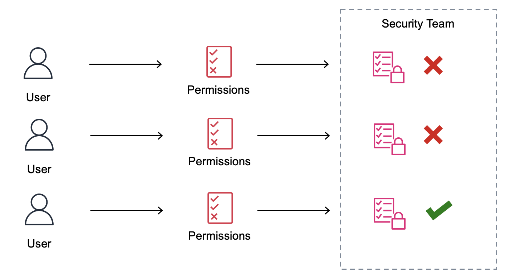
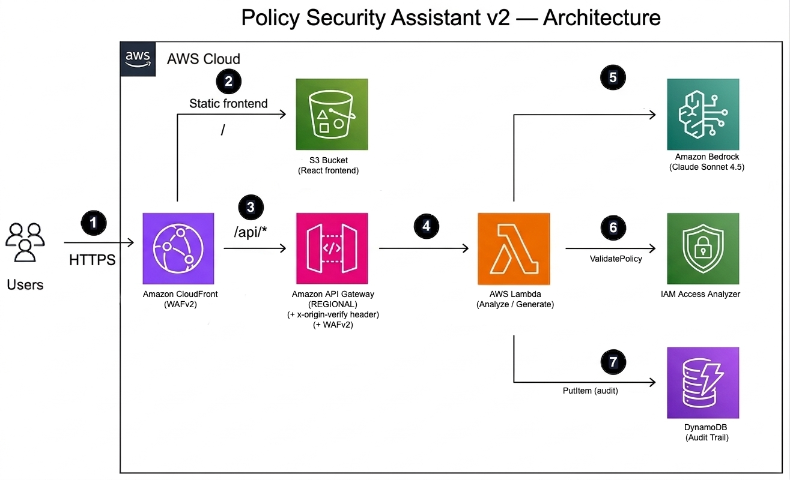

# How to Build a Security Assistant with Generative AI Using Amazon Bedrock and AWS

[Leer en español](./README.es.md) | [Leia em português](./README.pt.md)

[Amazon Bedrock](https://aws.amazon.com/bedrock/) is a fully managed service offering a selection of high-performance foundational models (FM) from leading AI companies through a single API, along with a comprehensive set of capabilities needed to create generative AI applications, simplifying development while maintaining privacy and security. Using Amazon Bedrock, it's possible to build a web self-service portal that checks whether an [AWS Identity and Access Management (IAM)](https://aws.amazon.com/iam/) policy adheres to the principle of least privilege, and even generate new policies from natural language descriptions — aiming to streamline the permission approval process within an organization without compromising security.

Organizations are constantly evolving, developing new projects and applications. Essential for these applications to function is having the necessary permissions and access to carry out various actions on AWS services and resources. These actions are specified through [IAM policies](https://docs.aws.amazon.com/IAM/latest/UserGuide/access_policies.html), expressed in JSON format.

Typically, project teams request permissions for their applications, and the organization's security team then validates, approves, or rejects these requests. Issues arise when project teams request access that doesn't align with the principle of least privilege. This challenge is magnified when security teams lack detailed insight into the applications and must enforce best practices. Due to the need for permission approvals, interactions between development and application areas can become bottlenecks, delaying the delivery of new projects and features to the organization.



Application teams often interact multiple times with the security department, aiming to gain the accesses their applications require.

Ensuring that permission requests adhere to the principle of least privilege from the start accelerates the approval process, reduces bottlenecks, and diminishes user frustration.

## Web Self-Service Portal

The application is a web self-service portal with two main features:

### Analyze Policy

Users can paste an IAM policy in JSON format and receive a detailed analysis. Amazon Bedrock (Claude Sonnet 4.5) validates the policy's syntax, assesses its compliance with the principle of least privilege based on specificity of actions, resource restrictions, effects, and conditions, highlights potential areas for improvement, and provides a compliance score on a scale of 1 to 10. Additionally, [IAM Access Analyzer](https://docs.aws.amazon.com/IAM/latest/UserGuide/access-analyzer-policy-validation.html) validates the policy to surface syntax errors, security warnings, and best-practice suggestions.

After the initial analysis, users can continue the conversation — asking the assistant to fix specific issues, add conditions, restrict resources, or generate an improved version of the policy.

### Generate Policy

Users can describe the permissions they need in natural language, and the assistant generates a least-privilege IAM policy. If the request is too broad (e.g., "full access to EC2"), the assistant asks for more specific details instead of generating an unsafe policy. Users can refine the policy through conversation — for example, asking to restrict to a specific region, add tag-based conditions, or include additional permissions.

Generated policies are automatically validated by IAM Access Analyzer before being returned to the user.


## Architecture

The following architecture diagram describes how the self-service portal operates.



The self-service portal uses [Amazon CloudFront](https://aws.amazon.com/cloudfront/) (1) as the single entry point, serving both the React frontend from an [Amazon S3](https://aws.amazon.com/s3/) bucket (2) and proxying API calls to [Amazon API Gateway](https://aws.amazon.com/api-gateway/) (3). CloudFront adds a secret origin header to API requests, ensuring that only requests through CloudFront reach the backend.

API Gateway invokes [AWS Lambda](https://aws.amazon.com/lambda/) functions (4), which send the policy to [Amazon Bedrock](https://aws.amazon.com/bedrock/) (5) for analysis or generation using Claude Sonnet 4.5, and to [IAM Access Analyzer](https://docs.aws.amazon.com/IAM/latest/UserGuide/access-analyzer-policy-validation.html) (6) for ground-truth policy validation. All requests are logged to [Amazon DynamoDB](https://aws.amazon.com/dynamodb/) (7) for audit purposes.

Both CloudFront and API Gateway are protected by [AWS WAFv2](https://aws.amazon.com/waf/) with managed rule groups for IP reputation, common exploits, and known bad inputs.

## Security

- The API Gateway is not directly exposed to the internet — all traffic flows through CloudFront, which adds a secret origin verification header. Lambda functions reject requests without this header.
- [AWS WAFv2](https://aws.amazon.com/waf/) protects both CloudFront and API Gateway with three AWS managed rule groups: IP reputation list, common rule set, and known bad inputs.
- All traffic is encrypted in transit (HTTPS enforced, TLS 1.2 minimum).
- S3 buckets have public access fully blocked; access is only through CloudFront Origin Access Control (OAC).
- Lambda execution roles follow least privilege — scoped to specific Bedrock model ARNs and DynamoDB table.
- API Gateway has a usage plan with rate limiting (10 req/s) and daily quota (1,000 requests).
- All requests are logged to DynamoDB for audit trail and to CloudWatch for observability.
- X-Ray tracing is enabled on Lambda and API Gateway.

## Implementation Guide

The solution is deployed using [AWS CDK](https://aws.amazon.com/cdk/). Amazon Bedrock models are [automatically accessible](https://aws.amazon.com/blogs/security/simplified-amazon-bedrock-model-access/) — no manual enablement is required.

### Prerequisites

- Python 3.13+
- Node.js 18+
- AWS CDK CLI (`npm install -g aws-cdk`)
- AWS CLI configured with appropriate credentials

### One-time setup

```bash
git clone https://github.com/aws-samples/policy-security-assistant.git
cd policy-security-assistant
npm install --prefix frontend
python -m venv cdk/.venv
source cdk/.venv/bin/activate
pip install -r cdk/requirements.txt
cdk bootstrap --app "python cdk/app.py"
```

### Build and deploy

```bash
npm run build --prefix frontend
cdk deploy --app "python cdk/app.py"
```

The CDK stack creates all the resources defined in the architecture. Once the deployment is completed, the CloudFront website URL will be displayed in the outputs. Open the link to access the security assistant.

No additional configuration is needed — CloudFront serves both the frontend and the API, so there are no API URLs or keys to configure manually.

### Redeploying after changes

- Lambda-only changes: `cdk deploy --app "python cdk/app.py"`
- Frontend changes: `npm run build --prefix frontend` then `cdk deploy --app "python cdk/app.py"`
- Infrastructure changes: `cdk diff --app "python cdk/app.py"` to preview, then `cdk deploy --app "python cdk/app.py"`

## Running Tests

```bash
pip install -r backend/requirements-test.txt
python -m pytest backend/tests/ -v
```

## Cost Considerations

This solution uses several AWS services that may incur costs:

- **Amazon Bedrock** — Charged per input/output token. Claude Sonnet 4.5 pricing applies. Each policy analysis or generation typically uses 1,000–3,000 tokens. See [Amazon Bedrock pricing](https://aws.amazon.com/bedrock/pricing/).
- **AWS Lambda** — Charged per request and compute duration. The free tier includes 1 million requests/month.
- **Amazon DynamoDB** — On-demand pricing for audit trail writes. Minimal cost for typical usage.
- **Amazon CloudFront** — Charged per request and data transfer. The free tier includes 1 TB/month.
- **AWS WAFv2** — Charged per web ACL, per rule, and per million requests inspected.
- **IAM Access Analyzer** — `ValidatePolicy` API calls are free.

For a demo or low-traffic internal tool, expect costs under $5/month excluding Bedrock usage. Bedrock costs depend on the volume of policy analyses and generations.

## Cleanup

To remove all resources and stop incurring costs:

```bash
cdk destroy --app "python cdk/app.py"
```

This will delete all resources created by the stack. Note that the DynamoDB audit table and the S3 logging bucket have `RemovalPolicy.RETAIN` and will not be deleted automatically — remove them manually from the AWS console if no longer needed.

## Conclusion

Using Amazon Bedrock and IAM Access Analyzer, it's possible to construct a self-service portal to assess if an Amazon IAM policy adheres to the principle of least privilege, and to generate new policies from natural language descriptions. The conversational interface allows users to iteratively refine policies until they meet security requirements, speeding up interactions between the security and application development areas.

Additionally, it's possible to modify this solution to integrate it into your organization's permission request workflow, for example, to automatically reject requests that don't meet a minimum compliance score. This will reduce the security team's backlog, leaving human interaction only for requests that comply with best practices.

## Note

This solution is a demonstration: The automated policy analysis and generation should be considered a suggestion. Before implementing any policy in your organization, make sure to validate it with a security specialist.


---

Author: Hernan Fernandez Retamal
