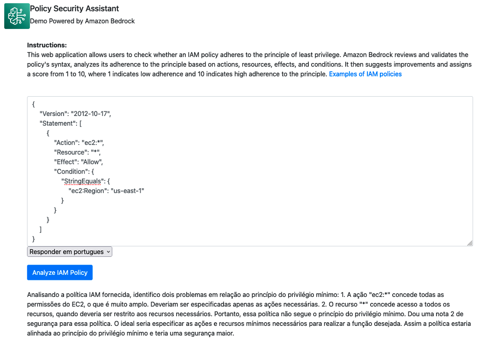
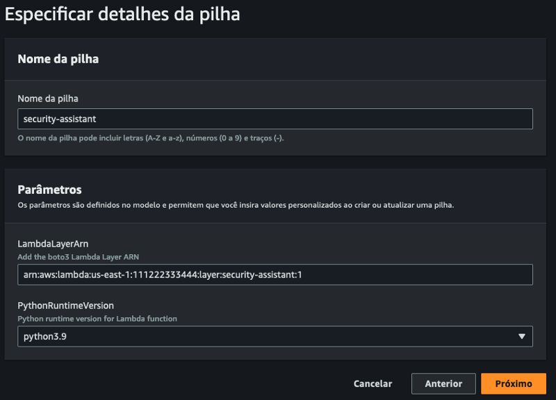
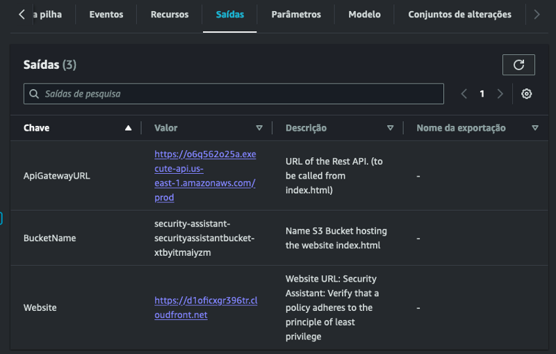

# Crie um assistente de segurança com IA generativa do Amazon Bedrock

[Read in English](./README.md) [leer en Español](./README.es.md)

O [Amazon Bedrock](https://aws.amazon.com/bedrock/) é um serviço totalmente gerenciado que oferece uma seleção de modelos básicos (FM) de alto desempenho das principais empresas de IA, como AI21 Labs, Anthropic, Cohere, Meta, Stability AI e Amazon, por meio de uma única API, junto com um amplo conjunto de recursos necessários para criar aplicativos de IA generativos, simplificando o desenvolvimento e mantendo a privacidade e a segurança. Usando o Amazon Bedrock, é possível criar um portal web de autoatendimento que permite validar se uma política do [AWS Identity and Access Management (IAM)](https://aws.amazon.com/iam/) está em conformidade com o princípio do menor privilégio. Essa abordagem busca agilizar o processo de aprovação de permissões dentro de uma organização sem comprometer a segurança.

As organizações estão em constante evolução desenvolvendo novos projetos e aplicativos. Uma parte essencial da operação desses aplicativos é que eles tenham permissões e acesso para realizar ações diferentes nos serviços e recursos da AWS. Essas ações são especificadas por meio de [políticas do IAM](https://docs.aws.amazon.com/IAM/latest/UserGuide/access_policies.html), que são expressas no formato JSON.

É normal que as áreas proprietárias dos projetos solicitem permissões para a operação de seus aplicativos e que a área de segurança da organização valide, aprove ou rejeite essas solicitações. O problema surge quando as áreas do projeto solicitam acessos que não estão em conformidade com o princípio do menor privilégio. Além disso, esse problema aumenta quando as áreas de segurança não têm os detalhes do escopo desses aplicativos e devem se limitar à aplicação de boas práticas. Devido à necessidade de aprovação da permissão, a interação entre áreas de desenvolvimento e aplicativos pode se tornar um gargalo que atrasa a entrega de novos projetos e funcionalidades para a organização.


As equipes que possuem aplicativos fazem uma ou mais interações com a área de segurança, a fim de obter os acessos que seus aplicativos exigem.

Fazer com que as solicitações de permissão estejam em conformidade com o princípio do menor privilégio desde a primeira solicitação acelera o processo de aprovação, reduz os gargalos e reduz a frustração do usuário.

## Portal de autoatendimento

O próximo aplicativo é um portal Web de autoatendimento, que permite aos usuários analisar se a política do IAM está em conformidade com as melhores práticas do princípio do menor privilégio. Nesse caso, o Amazon Bedrock analisará a política inserida e validará a sintaxe. Além disso, analisará a conformidade com o princípio do menor privilégio com base na especificidade das ações, restrição de recursos, efeitos e condições. Em seguida, ele explicará possíveis pontos de melhoria na política e fornecerá uma pontuação de conformidade em uma escala de 1 a 10. É nessa escala que 1 representa uma baixa conformidade com o princípio do menor privilégio e 10 corresponde a uma alta conformidade com ele.



## Arquitetura
O diagrama de arquitetura a seguir descreve como o portal de autoatendimento funciona.


O portal de autoatendimento consiste em uma distribuição do Amazon CloudFront (1)](https://aws.amazon.com/cloudfront/); ela distribui um formulário web que é armazenado em um bucket do [Amazon S3](https://aws.amazon.com/s3/).

O usuário insere a política do IAM no formulário web, que se comunica com o serviço [Amazon API Gateway](https://aws.amazon.com/api-gateway/) (3) usando o [AWS SDK para Javascript](https://aws.amazon.com/sdk-for-javascript/).

O Amazon API Gateway invoca a função AWS Lambda, que envia a política ao Amazon Bedrock e solicita que ele avalie sua sintaxe, princípio de privilégio mínimo, e forneça uma pontuação de 1 a 10, dependendo do nível de conformidade.

## Guia de implementação

A solução é implementada em três partes,

1. Ative o Amazon Bedrock no console da AWS
1. Criando a camada Lambda
1. Implantação da arquitetura via CloudFormation


### 1. Ativar o Amazon Bedrock


Abra o console [Amazon Bedrock](https://aws.amazon.com/bedrock/). No menu à esquerda, selecione [“Acesso ao modelo”](https://us-east-1.console.aws.amazon.com/bedrock/home?region=us-east-1#modelaccess), selecione o botão “Editar” e ative o modelo Anthropic > Claude e salve as alterações.

Lembre-se de que, na data de publicação deste artigo: o Amazon Bedrock está disponível nas seguintes regiões da AWS: Oeste dos EUA (Oregon), Ásia-Pacífico (Tóquio), Ásia-Pacífico (Cingapura), Leste dos EUA (Norte da Virgínia).

### 2. Criando a camada Lambda

Para a interação entre o Lambda e o Bedrock, precisaremos da versão 1.28.57 ou superior do [AWS Software Development Kit para Python (Boto3)](https://aws.amazon.com/sdk-for-python/). Para isso, precisamos criar uma Lambda Layer em um ambiente que tenha a versão 3.7 ou superior do Python. Se você não tiver um ambiente com Python 3.7 ou superior, poderá usar o console do [AWS CloudShell](https://aws.amazon.com/cloudshell/). 

Para fazer login no Amazon CloudShell, faça login no console da AWS. Na barra de navegação, selecione o ícone do serviço CloudShell ou, na barra de pesquisa, digite CloudShell. Um console será aberto no navegador, onde você poderá executar o seguinte comando.

```
curl -sSL https://raw.githubusercontent.com/aws-samples/policy-security-assistant/master/create-layer.sh | sh
```

Esse script criará um ambiente Python 3 com a versão 1.28.61 do boto3, empacotará o ambiente com o arquivo [boto3-layer.zip](https://console.aws.amazon.com/lambda/home?region=us-east-1#/layers/security-assistant/) e, via AWS CLI, o publicará como Layer Lambda. As versões Layer ARN e Python serão exibidas no final do script e serão usadas durante a implantação do modelo do CloudFormation.

A saída do script fornecerá informações semelhantes às seguintes. É necessário anotar essas informações, pois as usaremos na próxima etapa.

```
Python Version: 3.10
Layer ARN: "arn:aws:lambda:us-east-1:111222333444:layer:security-assistant:1"
```

### 3. Implantação do modelo CloudFormation

- [Repositório GitHub](https://github.com/aws-samples/policy-security-assistant/)
- [Criar camada create-layer.sh](https://github.com/aws-samples/policy-security-assistant/blob/main/create-layer.sh)
- [Modelo do CloudFormation](https://github.com/aws-samples/policy-security-assistant/blob/main/security-assistant.yaml)

Implantaremos a arquitetura usando o Amazon CloudFormation](https://aws.amazon.com/cloudformation/). Para fazer isso, baixaremos o [modelo](https://github.com/aws-samples/policy-security-assistant/blob/main/security-assistant.yaml) a seguir, acessaremos o console da AWS e, no serviço AWS CloudFormation, selecionaremos “Create Stack (with new resources)”. Em seguida, clicaremos em “Carregar um arquivo de modelo” e selecionaremos o modelo [security-assistant.yaml](https://github.com/aws-samples/policy-security-assistant/blob/main/security-assistant.yaml) que já foi baixado.

En la siguiente sección pondremos un nombre a nuestro stack según sea nuestra preferencia y llenaremos los campos LambdaLayerArn y PythonRuntimeVersion con la información obtenida en el paso anterior.



A pilha do CloudFormation criará os recursos definidos na arquitetura. Quando a criação da pilha estiver concluída, na seção Saída, encontraremos o URL do API Gateway do site e o nome do S3 Bucket. Ao abrir o link do site, podemos acessar o assistente de segurança.



## Conclusão

Usando o Amazon Bedrock, é possível criar um portal de autoatendimento para avaliar se uma política do Amazon IAM está em conformidade com o princípio do menor privilégio. Com isso, vamos agilizar a interação entre a área de segurança e o desenvolvimento de aplicativos.

Além disso, é possível modificar essa solução para integrá-la ao fluxo de solicitações de permissão da sua organização, por exemplo, para rejeitar automaticamente solicitações que não atendam a uma pontuação mínima de conformidade, isso reduzirá a lista de tarefas na área de segurança, deixando a interação humana apenas para solicitações que atendam às boas práticas.

## Observação
Esta solução é uma demonstração: A análise automatizada de políticas deve ser considerada uma sugestão, antes de aplicar uma política em sua organização certifique-se de validá-la com um especialista em segurança.
